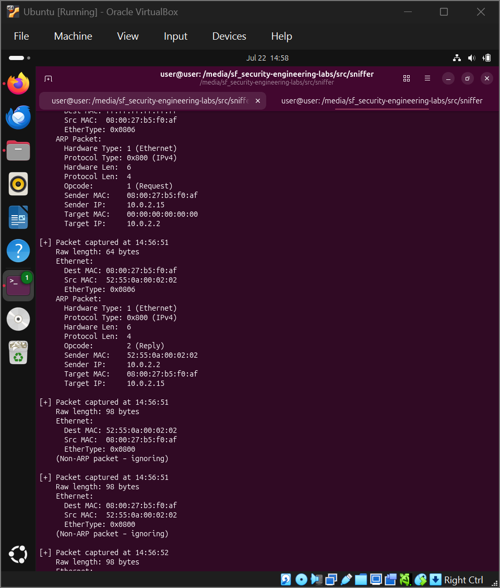

# Learning Log – security-engineering-labs

*This log is a continuation of my daily progress documentation. Days 1–14 cover the development of my [Network Toolkit](https://github.com/nabibit/Network_Toolkit) and foundational networking concepts. Days 15–35 cover the [sysadmin-lab](https://github.com/nabibit/sysadmin-lab) project on OS internals and system monitoring. You can find those entries in the [sysadmin-lab LEARNING_LOG.md](https://github.com/nabibit/sysadmin-lab/blob/main/docs/LEARNING_LOG.md).*

---

## [2026-07-18] – Day 36: Live Sniffer & Hexdump

### Concept
- **Packet sniffing:** Capturing live network traffic using Scapy's `sniff()` function.
- **Hexdump:** A hexadecimal representation of raw bytes, showing each byte as two hex digits.
- **Packet structure:** Raw bytes on the wire consist of headers (Ethernet → IP → TCP/UDP/ICMP) and payload.
- **Scapy:** Uses `libpcap` (Linux) or `WinPcap`/`Npcap` (Windows) to tap into network interfaces.

### Artifact
- Completed TryHackMe Linux Unhatched Modules 1–4 and "What is Networking?" room.
- Created `src/sniffer/live_sniffer.py` – a Python script that:
  - Captures live packets using Scapy.
  - Displays packet length, timestamp, hexdump of first 64 bytes, ASCII representation, and Scapy summary.
  - Runs until 50 packets are captured or interrupted by the user.
- Tested the sniffer by generating traffic with `ping` and browsing the web.
- Completed OverTheWire Bandit Level 13 – used an SSH private key to authenticate as `bandit14` after copying the key to my local machine.

### Key Observations
- The `PermissionError` when running the sniffer indicated that raw packet capture requires root privileges – solved by using `sudo`.
- Scapy's `sniff()` captures packets and calls a callback function for each one.
- The hexdump shows the raw bytes of each packet, revealing protocol headers and payload.
- Bandit Level 13 taught me that localhost connections are blocked on OverTheWire; the solution was to copy the private key locally and connect externally.

### Reflection
This lab introduced me to the fundamentals of packet analysis. Seeing raw bytes in hex and ASCII format made the concept of network protocols tangible. The hexdump output shows exactly what travels across the wire – from Ethernet headers to TCP payloads. Understanding how to capture and interpret packets is essential for network security, troubleshooting, and protocol analysis. The Bandit CTF reinforced the importance of understanding SSH authentication methods and permission management.

### Evidence
- **Commits:**
  - `feat: add live sniffer with hexdump output`
  - `docs(ctf): add bandit level 13 writeup`

---

## [2026-07-22] – Day 37: Ethernet & ARP Dissector

### Concept
- **Manual packet dissection:** Bypassing high-level parsing libraries by converting packets to raw bytes and using Python's `struct` module to slice headers based on exact protocol offsets.
- **Ethernet header structure:** 14 bytes total — Destination MAC (6 bytes, offset 0), Source MAC (6 bytes, offset 6), and EtherType (2 bytes, offset 12) identifying the payload protocol (e.g., ARP `0x0806`, IPv4 `0x0800`, IPv6 `0x86dd`).
- **ARP payload structure:** 28 bytes containing hardware type, protocol type, hardware length, protocol length, opcode (1 for Request, 2 for Reply), sender MAC/IP, and target MAC/IP.
- **Raw socket privileges:** Sniffing raw network traffic on Linux requires root privileges (`sudo`).

### Artifact
- Completed TryHackMe "Search Skills" room (100% completion) covering Shodan, VirusTotal, and CVE vulnerability databases.
- Completed Cisco Linux Unhatched Modules 5–9 (filesystem hierarchy, permissions, command-line operations).
- Completed OverTheWire Bandit Level 15 – retrieving passwords and publishing writeups.
- Created `src/sniffer/packet_dissector.py` – a Python script that:
  - Captures raw packets live using Scapy.
  - Manually parses Ethernet headers using exact byte offsets and `struct.unpack('!H', ...)`.
  - Dissects the 28-byte ARP payload to extract hardware lengths, protocol types, opcodes, and IPv4/MAC address mappings.

### Key Observations
- Raw packet sniffing fails with a `PermissionError` unless executed with `sudo` due to Linux kernel security restrictions on raw sockets.
- ARP traffic is relatively quiet on a modern idle network; flushing the neighbor cache (`sudo ip neigh flush all`) and pinging the gateway (`ping 10.0.2.2`) immediately forces ARP resolution, allowing the script to capture and dissect Requests and Replies.
- Manual byte dissection with `struct` forces a precise understanding of network-byte-order (`!`) and integer packing, bridging network theory directly with low-level systems programming.
- The dissector successfully parsed live ARP traffic, confirming that the packet offsets match the RFC specifications.

### Screenshot
Below is a screenshot of the packet dissector output, showing a captured ARP Request:

### Reflection
Building a manual packet dissector bridges the gap between high-level scripting and low-level network protocol analysis. Using Python's `struct` module to physically slice bytes at exact offset boundaries makes the RFC specifications concrete. Instead of relying on a library to do the parsing magic, calculating the exact byte positions for MAC addresses and EtherTypes reveals how operating systems process data straight off the wire. Combined with OSINT search skills and Linux fundamentals practice, this lab reinforces both offensive/defensive context and core engineering capability.

### Evidence
- **Commits:**
  - `docs: add Ethernet and ARP protocol notes`
  - `feat: add Ethernet and ARP dissector`
  - `docs(ctf): add bandit level 15 writeup`

---