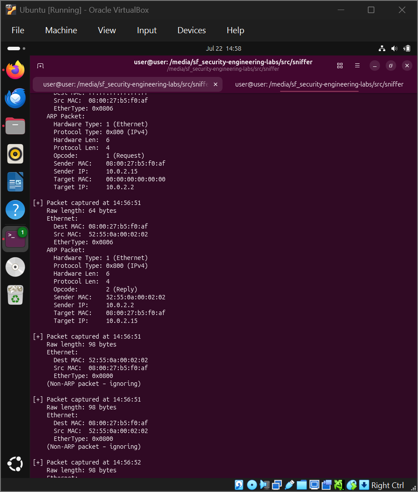
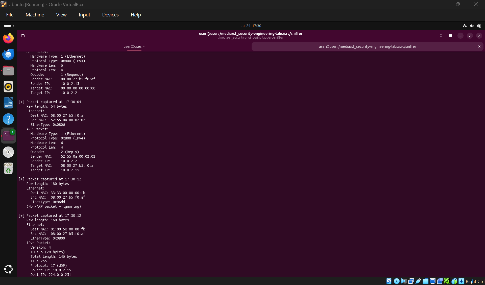
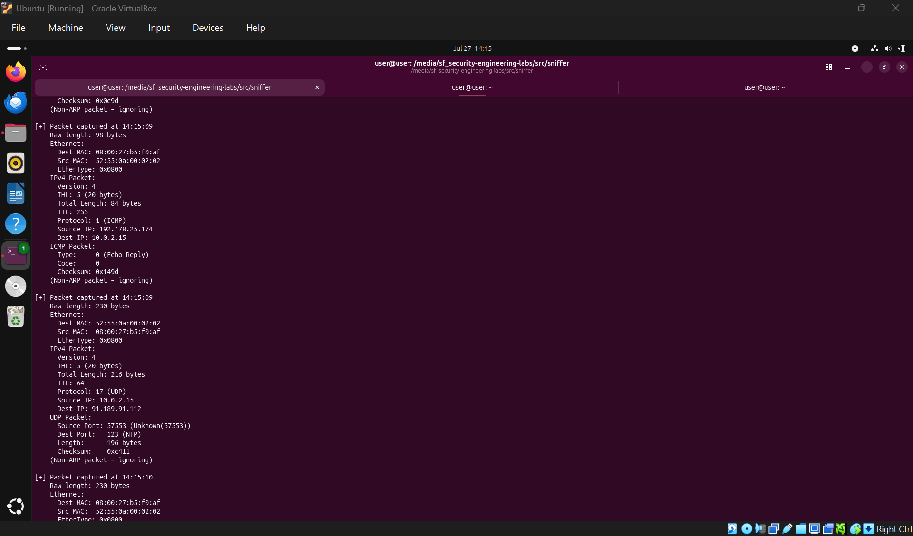
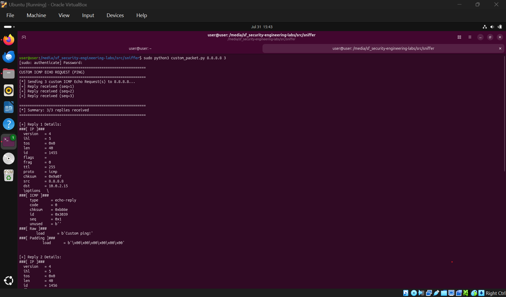

# Learning Log – security-engineering-labs

*This log is a continuation of my daily progress documentation. Days 1–14 cover the development of my [Network Toolkit](https://github.com/nabibit/Network_Toolkit) and foundational networking concepts. Days 15–35 cover the [sysadmin-lab](https://github.com/nabibit/sysadmin-lab) project on OS internals and system monitoring. You can find those entries in the [sysadmin-lab LEARNING_LOG.md](https://github.com/nabibit/sysadmin-lab/blob/main/docs/LEARNING_LOG.md).*

---

## [2026-07-18] – Day 36: Live Sniffer & Hexdump

### Concept
- **Packet sniffing:** Capturing live network traffic using Scapy's `sniff()` function.
- **Hexdump:** A hexadecimal representation of raw bytes, showing each byte as two hex digits.
- **Packet structure:** Raw bytes on the wire consist of headers (Ethernet → IP → TCP/UDP/ICMP) and payload.
- **Scapy:** Uses `libpcap` (Linux) or `WinPcap`/`Npcap` (Windows) to tap into network interfaces.

### Artifact
- Completed TryHackMe Linux Unhatched Modules 1–4 and "What is Networking?" room.
- Created `src/sniffer/live_sniffer.py` – a Python script that:
  - Captures live packets using Scapy.
  - Displays packet length, timestamp, hexdump of first 64 bytes, ASCII representation, and Scapy summary.
  - Runs until 50 packets are captured or interrupted by the user.
- Tested the sniffer by generating traffic with `ping` and browsing the web.
- Completed OverTheWire Bandit Level 13 – used an SSH private key to authenticate as `bandit14` after copying the key to my local machine.

### Key Observations
- The `PermissionError` when running the sniffer indicated that raw packet capture requires root privileges – solved by using `sudo`.
- Scapy's `sniff()` captures packets and calls a callback function for each one.
- The hexdump shows the raw bytes of each packet, revealing protocol headers and payload.
- Bandit Level 13 taught me that localhost connections are blocked on OverTheWire; the solution was to copy the private key locally and connect externally.

### Reflection
This lab introduced me to the fundamentals of packet analysis. Seeing raw bytes in hex and ASCII format made the concept of network protocols tangible. The hexdump output shows exactly what travels across the wire – from Ethernet headers to TCP payloads. Understanding how to capture and interpret packets is essential for network security, troubleshooting, and protocol analysis. The Bandit CTF reinforced the importance of understanding SSH authentication methods and permission management.

### Evidence
- **Commits:**
  - `feat: add live sniffer with hexdump output`
  - `docs(ctf): add bandit level 13 writeup`

---

## [2026-07-22] – Day 37: Ethernet & ARP Dissector

### Concept
- **Manual packet dissection:** Bypassing high-level parsing libraries by converting packets to raw bytes and using Python's `struct` module to slice headers based on exact protocol offsets.
- **Ethernet header structure:** 14 bytes total — Destination MAC (6 bytes, offset 0), Source MAC (6 bytes, offset 6), and EtherType (2 bytes, offset 12) identifying the payload protocol (e.g., ARP `0x0806`, IPv4 `0x0800`, IPv6 `0x86dd`).
- **ARP payload structure:** 28 bytes containing hardware type, protocol type, hardware length, protocol length, opcode (1 for Request, 2 for Reply), sender MAC/IP, and target MAC/IP.
- **Raw socket privileges:** Sniffing raw network traffic on Linux requires root privileges (`sudo`).

### Artifact
- Completed TryHackMe "Search Skills" room (100% completion) covering Shodan, VirusTotal, and CVE vulnerability databases.
- Completed Cisco Linux Unhatched Modules 5–9 (filesystem hierarchy, permissions, command-line operations).
- Completed OverTheWire Bandit Level 15 – retrieving passwords and publishing writeups.
- Created `src/sniffer/packet_dissector.py` – a Python script that:
  - Captures raw packets live using Scapy.
  - Manually parses Ethernet headers using exact byte offsets and `struct.unpack('!H', ...)`.
  - Dissects the 28-byte ARP payload to extract hardware lengths, protocol types, opcodes, and IPv4/MAC address mappings.

### Key Observations
- Raw packet sniffing fails with a `PermissionError` unless executed with `sudo` due to Linux kernel security restrictions on raw sockets.
- ARP traffic is relatively quiet on a modern idle network; flushing the neighbor cache (`sudo ip neigh flush all`) and pinging the gateway (`ping 10.0.2.2`) immediately forces ARP resolution, allowing the script to capture and dissect Requests and Replies.
- Manual byte dissection with `struct` forces a precise understanding of network-byte-order (`!`) and integer packing, bridging network theory directly with low-level systems programming.
- The dissector successfully parsed live ARP traffic, confirming that the packet offsets match the RFC specifications.

### Screenshot
Below is a screenshot of the packet dissector output, showing a captured ARP Request:

### Reflection
Building a manual packet dissector bridges the gap between high-level scripting and low-level network protocol analysis. Using Python's `struct` module to physically slice bytes at exact offset boundaries makes the RFC specifications concrete. Instead of relying on a library to do the parsing magic, calculating the exact byte positions for MAC addresses and EtherTypes reveals how operating systems process data straight off the wire. Combined with OSINT search skills and Linux fundamentals practice, this lab reinforces both offensive/defensive context and core engineering capability.

### Evidence
- **Commits:**
  - `docs: add Ethernet and ARP protocol notes`
  - `feat: add Ethernet and ARP dissector`
  - `docs(ctf): add bandit level 15 writeup`

---

## [2026-07-24] – Day 38: IPv4 Header Dissection

### Concept
- **IPv4 header structure (RFC 791):** Defines the minimum 20-byte IP header containing Version (4 bits), Internet Header Length / IHL (4 bits), Type of Service, Total Length, Identification, Flags, Fragment Offset, Time to Live (TTL), Protocol, Header Checksum, Source IP, and Destination IP.
- **IHL math:** IHL represents the number of 32-bit words in the header; multiplying IHL by 4 yields the exact header length in bytes (standard minimum header size is $5 \times 4 = 20$ bytes).
- **Transport protocols:** The 8-bit Protocol field identifies the higher-layer payload (e.g., `1` for ICMP, `6` for TCP, `17` for UDP).
- **Network byte order unpacking:** Using Python's `struct.unpack('!B', ...)` and `!H` ensures multi-byte binary fields are read correctly from network order (big-endian).

### Artifact
- Created `src/protocols/ipv4.py` – a modular Python script that manually slices raw packet data to parse IPv4 header attributes and translate protocol IDs.
- Integrated IPv4 parsing logic into the main packet sniffing framework, allowing simultaneous processing of Ethernet, ARP, and IPv4 frames.
- Completed Cisco Linux Unhatched Modules 14.1-16.
- Captured `docs/images/ipv4_dissection.png` showing the terminal output successfully extracting IPv4 fields (Version, IHL, Total Length, TTL, Protocol, Source/Dest IPs).

### Key Observations
- Standard IPv4 headers without options register an IHL of `5` ($5 \times 4 = 20$ bytes).
- The protocol number accurately points to the payload type (e.g., protocol `17` for UDP traffic heading towards multicast/DNS endpoints).
- Combining manual dissectors modularly (`src/protocols/`) keeps the codebase clean and separates raw byte-slicing logic from high-level capture orchestration.

### Screenshot
Below is a screenshot of the packet dissector capturing and parsing a live IPv4 packet:

### Reflection
Moving from Layer 2 (Ethernet/ARP) up to Layer 3 (IPv4) solidifies the concept of encapsulation. Watching raw bytes transform into structured metrics—like tracking a packet's TTL or identifying transport protocols through byte-offset math—bridges foundational RFC theory with practical security engineering. Overcoming Bandit Level 18 reinforced non-interactive SSH tricks, while the Linux and OSI theory work completed the loop for infrastructure fundamentals.

### Evidence
- **Commits:**
  - `docs: add IPv4 header protocol notes`
  - `feat: add IPv4 header dissector`

---

## [2026-07-27] – Day 39: UDP & ICMP Dissection

### Concept
- **UDP Header Structure (RFC 768):** A minimalist, connectionless transport layer protocol consisting of an 8-byte header: Source Port (2 bytes), Destination Port (2 bytes), Length (2 bytes), and Checksum (2 bytes).
- **ICMP Header Structure (RFC 792):** An essential network control and diagnostic protocol. The mandatory 4-byte base header contains Type (1 byte), Code (1 byte), and Checksum (2 bytes), followed by variable payload data depending on the message type.
- **Demultiplexing / Protocol Routing:** The IPv4 header's 8-bit `Protocol` field acts as the routing switch for incoming payloads: value `17` directs bytes to the UDP parser, while value `1` routes to the ICMP parser.
- **Port Mapping:** Mapping 16-bit integer port numbers (e.g., `53` to DNS, `123` to NTP) to standard human-readable services provides immediate contextual awareness during traffic analysis.

### Artifact
- Created `src/protocols/udp.py` – a standalone Python module utilizing `struct.unpack('!H', ...)` to extract 16-bit UDP header fields and resolve network service names.
- Created `src/protocols/icmp.py` – a standalone module that extracts ICMP types/codes and maps standard diagnostic messages (e.g., Type `8` for Echo Request, Type `0` for Echo Reply, Type `3` for Destination Unreachable).
- Updated `src/protocols/ipv4.py` by adding `get_payload_offset()` to calculate dynamic IPv4 header lengths ($IHL \times 4$), ensuring exact byte boundaries when slicing transport layer payloads.
- Integrated both UDP and ICMP parsers into `src/sniffer/protocol_sniffer.py`, enabling live, multi-layer encapsulation decoding (Ethernet $\rightarrow$ IPv4 $\rightarrow$ UDP/ICMP).
- Completed Cisco Linux Unhatched Modules 17–20, advancing my command-line administration and system configuration capabilities.
- Completed OverTheWire Bandit Level 17, documenting the solution and key takeaways in my CTF repository.
- Captured `docs/images/udp_icmp_dissection.png` showing the live dissector successfully isolating and decoding NTP queries (UDP Port 123) and ICMP Echo Reply packets in real-time.

### Key Observations
- UDP's 8-byte fixed header imposes minimal overhead compared to TCP, making it highly efficient for stateless services like NTP (Network Time Protocol on port 123) and DNS.
- When parsing ICMP packets generated via network activity, the dissector clearly identifies incoming Type `0` (Echo Reply) packets from external routers.
- Relying on dynamic offset calculations (`ihl * 4`) rather than assuming a static 20-byte IPv4 header prevents byte-misalignment errors when slicing the payload for upper-layer protocols.

### Screenshot
Below is a screenshot of the manual dissector capturing and parsing live UDP (NTP) and ICMP (Echo Reply) traffic:

### Reflection
Implementing Layer 4 (UDP) and Layer 3.5 control protocols (ICMP) completes a functional, multi-layer network analysis tool. Writing the demultiplexing logic—where the IPv4 protocol field acts as a traffic controller handing off byte arrays to specialized parsers—mirrors how actual kernel network stacks operate. Seeing raw hexadecimal bytes transform live into structured NTP port mappings and ICMP diagnostic codes solidifies my understanding of network encapsulation and RFC standards. Combining this systems programming work with Linux Modules 17–20 and Bandit Level 17 continues to strengthen my foundational cybersecurity skill set.

### Evidence
- **Commits:**
  - `docs: add UDP and ICMP protocol notes`
  - `feat: add UDP and ICMP dissectors`
  - `docs(ctf): add bandit level 17 writeup`
---

## [2026-07-31] – Day 40: Crafting Custom Packets

### Concept
- **Scapy packet crafting:** Utilizing the `/` operator to stack protocol layers seamlessly (e.g., `Ether()/IP()/ICMP()`).
- **Network Transmission Functions:** Differentiating between `send()` (transmits at Layer 3 without awaiting a reply), `sr1()` (sends and waits for exactly one reply), and `sr()` (sends and waits for all replies).
- **Manual Checksum Calculation:** Understanding that the ICMP checksum is derived from the 16-bit one's complement of the one's complement sum of the ICMP header and data, requiring the checksum field to be zeroed out prior to calculation.
- **Raw Packet Construction:** Shifting from passive dissection to active packet generation by manually calculating header fields and structuring byte arrays.

### Artifact
- Created `src/sniffer/custom_packet.py` – an advanced Python script that:
  - Constructs custom ICMP Echo Request packets from scratch, incorporating manual checksum validation.
  - Allows precise customization of the ICMP ID, sequence number, and underlying data payload.
  - Leverages Scapy's `sr1()` function to transmit the crafted packets and capture incoming replies.
  - Processes command-line arguments to dictate the destination IP and request count.
- Completed OverTheWire Bandit Level 18 (SSH with command execution) and added the write-up.

### Key Observations
- Scapy's `/` operator significantly abstracts the complexity of encapsulation, making packet construction highly readable and intuitive.
- The `sr1()` function is perfectly suited for ping-like operations where a 1:1 request-to-response mapping is expected.
- Implementing the manual checksum calculation forced a deeper understanding of RFC 792; if the checksum is incorrectly calculated, the target OS drops the packet silently.
- Injecting custom payloads into ICMP packets acts as a proof-of-concept for testing firewall rules or demonstrating data exfiltration vectors.

### Screenshots
Below is a screenshot of the custom packet script output demonstrating successful transmission and response capture:

### Reflection
Transitioning from packet analysis to active packet crafting bridges the gap between understanding protocol headers and manipulating them defensively/offensively. The manual checksum calculation was a particularly rigorous exercise—it stripped away the "magic" of high-level libraries and exposed exactly how ICMP packets are validated by the receiving network stack. Utilizing Scapy's `sr1()` completed the transmission cycle seamlessly. This lab highlighted the true power of Scapy for security assessments: the ability to forge explicit, non-standard packets to observe how target systems respond.

### Evidence
- **Commits:**
    - `feat: add custom ICMP Echo Request packet crafting`
    - `docs: add bandit level 18 writeup` (CTF repo)
---

## [2026-10-04] – Day 41: TCP Header Dissection (Part 1)

### Concept
- **TCP header structure (RFC 793):** Minimum 20-byte header containing Source Port, Destination Port, Sequence Number, Acknowledgment Number, Data Offset, Flags, Window Size, Checksum, Urgent Pointer, and optional Options.
- **Data Offset:** High 4 bits of byte 12 – multiplied by 4 gives the actual header length in bytes (allows for variable-length options).
- **TCP flags:** 9 control bits (NS, CWR, ECE, URG, ACK, PSH, RST, SYN, FIN) used for connection management and flow control.
- **TCP vs UDP:** TCP's 20+ byte header vs UDP's fixed 8 bytes – more overhead but provides reliability, ordering, and connection state.

### Artifact
- Added TCP header structure and flag values to `docs/PROTOCOL_NOTES.md`.
- Created `src/protocols/tcp.py` – a Python module that manually parses TCP headers using `struct.unpack()`, extracts all fields, decodes flag names, and calculates the payload offset.
- Tested module import successfully.

### Key Observations
- The Data Offset field is essential – TCP headers can be longer than 20 bytes if options are present.
- Flags are bit-packed into a single byte (plus 1 bit), requiring bitwise AND to decode.
- TCP port mapping allows quick identification of services (HTTP, SSH, HTTPS, etc.).
- Manual parsing reinforces the importance of byte-order (`!` for network/big-endian).

### Reflection
TCP is the most complex transport protocol I've dissected so far. Unlike UDP's fixed 8-byte header, TCP has variable-length options, bit-packed flags, and state-tracking fields (sequence/acknowledgment numbers). Building the dissector manually makes the abstraction disappear – I now understand exactly where each byte sits and why. Next session will integrate TCP into the packet dissector and capture a live three-way handshake.

### Evidence
- **Commits:**
  - `docs: add TCP header protocol notes`
  - `feat: add TCP header dissector`
---